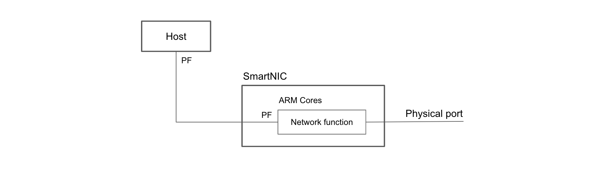
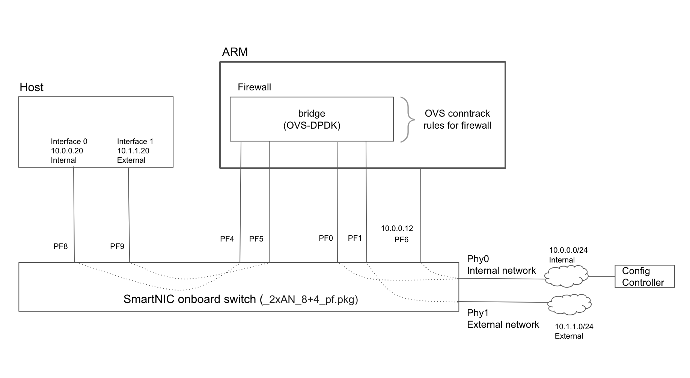

### Introduction

The SmartNIC presents a set of PFs to the Host and by default they provide connectivity to the network via its physical ports, much like any other NIC. However, one of the SmartNIC's unique features is that it allows Host-side PFs to connect to PFs of the ARM cores on the SmartNIC. This causes all packets to be processed by the ARM cores as they enter and leave the Host on their way to and from the physical ports.  

This opens up the possibility of running a wide variety of network functions on the SmartNIC, especially ones that take the form of a "bump in the wire". 



A good example of such a network function is a stateful firewall and this project shows how to implement one. It also serves as a template for implementing other network functions on the SmartNIC.

### Firewall

Let us suppose that we want two of the PFs seen by the Host to be behind a firewall. One of them (say interface 0) will be connected to an "internal" network and the other (say interface 1) to an "external network". As the names suggest, the internal network is internal to the enterprise and the machines on this network have full access to the Host, but no other networks can be accessed via this interface. The external interface can connect to any other network on the outside, but the firewall restricts the type of traffic that is allowed across the interface. Specifically, the rules for this firewall are as follows:  

Internal network (interface 0)  
-	allow inbound connections from within the network's IP address space
-	permit outbound connections to within the network's IP address space
-	permit traffic associated with a connection established under the above rules
-	discard anything else

External network (interface 1)
-	allow inbound connections on TCP port 22
-	permit outbound connections except for TCP port 25 (to make spamming harder)
-	permit traffic associated with a connection established under the above rules
-	discard anything else

The figure below shows the configuration.  


PF8 and PF9 on the Host side are paired with PF4 and PF5 of the ARM cores on the SmartNIC side. This forces all traffic on PF8 and PF9 to go through PF4 and PF5 on the ARM side where they are processed by the firewall before being sent out on the physical ports. PF0 and PF1 connect the firewall to the physical ports. PF6 on the ARM side is also connected to the internal network but it is not part of the firewall implementation.

### Prerequisites
#### SmartNIC
1. The SmartNIC should be running CentOS 7. Instructions on installing CentOS can be found in the [Stingray PS225 Quickstart Guide](https://github.com/CCX-Stingray/Documentation/blob/master/5880X-PS225-UG1xx.pdf), section 5.2. 
2. The configuration on the card should support SR-IOV and PF pairs e.g. `bcm958802a8028_2x25g_8+4_pf.cfg`
#### Config Controller
1. Install [Ansible](https://www.ansible.com/) if the system does not have it. You can find installation instructions [here.](https://docs.ansible.com/ansible/latest/installation_guide/intro_installation.html?extIdCarryOver=true&sc_cid=701f2000001OH7YAAW)
2. Ensure [ssh access](https://docs.ansible.com/ansible/latest/user_guide/connection_details.html#ssh-key-setup) to the SmartNIC. The public key of the Config Controller should be registered as an authorized key on the SmartNIC.

### Creating and Running the Firewall
1. Clone this repository to the Config Controller; then `cd Getting-Started/firewall`
2. Edit the `ansible.cfg` file and replace the placeholder with a fully qualified path to the current directory
```INI
[defaults]
...
fact_caching_connection = path-to-this-directory
...
```
3. Edit the IP address of the SmartNIC and other parameters in the `inventory` file to match your setup  
For example:  
`smartnic ansible_host=10.0.0.12 bridge_ip=10.0.0.10`    
Note: The variable `ansible_host` refers to the SmartNIC itself, not the Host machine in which it is installed.  
To configure multiple hosts, additional lines can be added to the `inventory` file, one per host.  
4. To install all the necessary software on the SmartNIC, run `install.sh`
5. To create the firewall run `firewall.sh`
6. To undo all the configuration and remove the firewall, run `teardown_firewall.sh`
7. The scripts keep track of what is configured and started. This allows you to run the scripts multiple times without error; they simply skip what has already been configured. However, if you have a firewall running and reboot the SmartNIC without executing the `teardown_firewall.sh` script, the actual state of the card will no longer be in sync with the history maintained by the scripts. In that case, run the `flush_history.sh` script to flush the history.

### Performance
`iperf` can be used to test the throughput across the firewall. On our test setup, this is what we measured.
```
iperf3 -P 24 -l 256K -w 512K -c 10.1.1.1
[SUM]   0.00-10.00  sec  16.4 GBytes  14.1 Gbits/sec  25700           sender
[SUM]   0.00-10.00  sec  16.4 GBytes  14.1 Gbits/sec                  receiver

```

This is lower than the throughput one would observe across an OVS-DPDK bridge on the SmartNIC if the firewall rules were not in place, and that value can be [found here](https://github.com/CCX-Stingray/Getting-Started/tree/master/ovs-offload) for comparison.

### References
1. OVS + iptables demo setup Engineering Note, Version 0.0 (20190711a)
