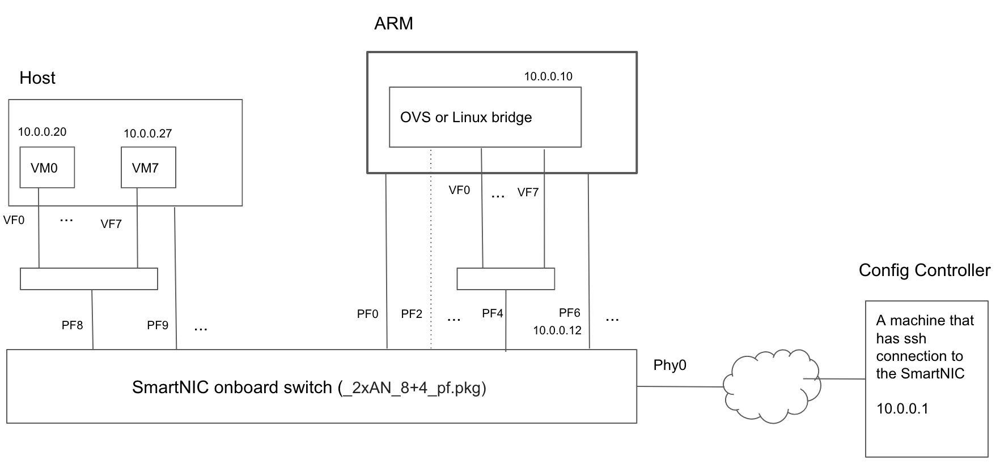

### Introduction
It is possible to install a stock CentOS Linux distribution on the SmartNIC as described here. Once that is done, a common use-case would be to run an OVS-DPDK or  Linux bridge and use VF-pairs to connect VMs to the bridge. This would offload the bridging function from the host to the SmartNIC. 

This document describes the software and scripts to do this in an easy and repeatable manner.

### Software
The following pieces of software have to be installed on the SmartNIC
* `bnxt-ctl`
* `DPDK` (version 18.11.6)
* `OVS`

Scripts and Ansible playbooks have been developed to automate the installation of the software. They also automate the process of configuring the OVS and Linux bridges. They are executed from a machine (Config Controller) that has ssh access to the SmartNIC. This repository contains these scripts.

### Configuration
The Stingray device can be configured in different combinations of ARM-side and host-side PFs. For any given combination, there is a lot of flexibility in hows the PFs and VFs on each side are interconnected. The diagram below shows the specific configuration that is assumed by the scripts; they can be easily modified to work for different a configuration.



This configuration allows 8 VMs on the host to use 8 VFs which are connected to the bridge running on the SmartNIC. From a functionality perspective, this is no different than if the bridge was running on the host instead of being offloaded to the SmartNIC.

### Prerequisites
#### SmartNIC
1. The SmartNIC should be running CentOS 7. Instructions on installing CentOS can be found in the Stingray PS225 Quickstart Guide, section 5.2. 
2. The Nitro configuration on the card should support SR-IOV and VF pairs e.g. `bcm958802a8028_2x25g_8+4_pf.cfg`
#### Config Controller
1. Install [Ansible](https://www.ansible.com/) if the system does not have it. You can find installation instructions [here.](https://docs.ansible.com/ansible/latest/installation_guide/intro_installation.html?extIdCarryOver=true&sc_cid=701f2000001OH7YAAW)
2. Add the following to your Ansible configuration  
```INI
[defaults]
gathering = smart
fact_caching = jsonfile
fact_caching_connection = <fully qualified path to a directory in the local filesystem e.g current directory>
fact_caching_timeout = 86400
```
3. Ensure [ssh access to the SmartNIC](https://docs.ansible.com/ansible/latest/user_guide/connection_details.html#ssh-key-setup). The public key of the Config Controller should be registered as an authorized key on the SmartNIC.
### Installation and Usage
1. The scripts to install the software on the SmartNIC and configure it can be obtained by cloning this repository  
2. To install all the necessary software on the SmartNIC, run
	`install.sh`
3. To configure a Linux bridge and connect the VF pairs as shown in the diagram, run `linux_bridge.sh`
4. To configure a OVS bridge and connect the VF pairs as shown in the diagram,
  - Edit the file `roles/setup_ovs_flows/files/setup_ovs_flows.sh` to configure OpenFlow rules that match the MAC addresses of the VFs on your Host. If these rules will be configured elsewhere (say by an OpenFlow controller), comment out all the lines in this file.
  - Run `ovs_bridge.sh`
5. The IP address of the Host, the Host PF and other parameters can be configured in the `inventory` file.  
For example:  
`smartnic ansible_host=10.0.0.12 host_pf=8 num_vfs=8 bridge_ip=10.0.0.10 gateway_ip=10.0.0.1`  
6. To configure multiple hosts, additional lines can be added to the `inventory` file, one per host.  
7. To undo all the configuration and remove the bridge (Linux or OVS), run `teardown_all.sh`
8. The scripts keep track of what is configured and started. This allows you to run the scripts multiple times without error; they simply skip what has already been configured. Running the teardown_all script updates the history. However, if you have a bridge running and reboot the SmartNIC without running the teardown_all script, the actual state of the card will no longer be in sync with the history maintained by the scripts. In that case, run the `flush_history.sh` script to flush the history.
