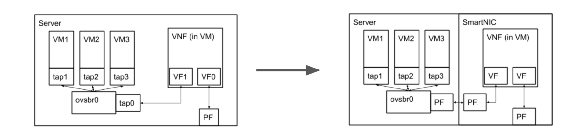
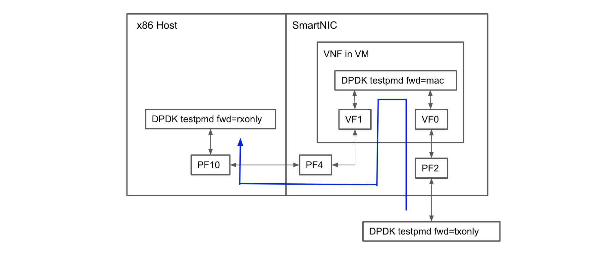

### Introduction

A Virtual Network Function (VNF) which typically runs inside a virtual machine on a server, can also be run on the SmartNIC. This isolates the network function from the applications running on the server and also reduces the server's workload. 

This is an example of how a VNF deployment in the server could be re-architected to run on the SmartNIC.



**Figure 1**  

### Implementation
In this sample implementation, we will show you how to instantiate a virtual machine on the SmartNIC with the same connectivity as shown in Figure 1. In place of an actual VNF, we will forward packets between the VFs using DPDK. This will show the level of performance that a VNF can achieve when running on the SmartNIC. On the Host, we will also receive the packets using DPDK. In an actual deployment, the Host will  of course be running its own applications to consume those packets.



**Figure 2**  

### Prerequisites
1. The SmartNIC should be running CentOS 7. Instructions on installing CentOS can be found in the [Stingray PS225 Quickstart Guide](https://github.com/CCX-Stingray/Documentation/blob/master/5880X-PS225-UG1xx.pdf), section 5.2. 
2. Install the following packages on the SmartNIC using
```
yum install qemu-kvm-ma genisoimage
``` 

#### Kernel and DTB
Instantiating a VM requires specific support in the kernel and DTB which may not be present in the versions shipped with the SmartNIC. 

To rebuild the kernel with virtual machine support, add the following to the kernel configs
``` INI
CONFIG_VFIO_NOIOMMU=n
CONFIG_HAVE_ARCH_SECCOMP_FILTER=y
CONFIG_SECCOMP_FILTER=y
CONFIG_SECCOMP=y
CONFIG_BNXT_SRIOV=y
CONFIG_BNXT_FLOWER_OFFLOAD=y
```

Use `arch/arm64/boot/dts/broadcom/stingray/custom/bcm958804a8046i/bcm958804a8046i-pcie-iommu.dtb` as the DTB.

In our tests, we used kernel version 4.14.119.

#### VM Image
We use an image from the Ubuntu [cloud image repository](https://cloud-images.ubuntu.com/bionic/). 

### Installation and Usage
Clone this repository on the SmartNIC, then `cd Getting-Started/vnf`

#### cloud-init
The Ubuntu virtual machine images have [cloud-init](https://cloudinit.readthedocs.io/en/latest/#) installed. We use it to add SSH public keys to the image which allows us to access the VM once it is running. They are passed as part of the cloud-init metadata in the form of an ISO image on a virtual CD-ROM drive that the VM can read. 

* Edit the `user-data` file to replace the SSH key with your SSH public key on the SmartNIC (since you will be ssh'ing to the VM from the SmartNIC). 
```
    ssh-authorized-keys:
      - ssh-rsa AAAAB3NzaC1yc2EAAAADAQABAAABAQRR..........nqQMJvZovKl0Tto9PB root@localhost.localdomain
```

* Then run `mk-ci-iso.sh`

#### Creating the VFs.
To create the VFs and prepare them to be attached to the VM, run `create_vfs.sh`.

#### Starting the VM
To start the VM run `launch_vm.sh`. This starts the VM with the appropriate cloud-init information and also attaches the VFs to the VM.

If you are using a different image, edit this line in the script before running it.
```
...
-drive if=none,id=image,file=bionic-server-cloudimg-arm64.img \ # replace with your image name
...
```

After the VM is running you can access it using `ssh -p 2222 ubuntu@localhost`

### Benchmarking
As we explained earlier, we use DPDK/testpmd to forward packets between the VFs to simulate a VNF application. 

Packets are sent from a machine running DPDK/testpmd in transmit mode, that is connected to physical port 0 of the SmartNIC. These packets reach VF0, where the DPDK/testpmd application running in the VM forwards the packets to VF1 and changes the destination MAC address to that of PF10 on the Host. On the Host we again run DPDK/testpmd, this time in receive mode, bound to PF10. We measure the received packet rate at this point.

The blue line in Figure 2 shows the packet flow.

In our setup the SmartNIC was connected to the packet generator on a 25Gbps link over physical port 0. We measured 10Mpps (64B packets) traversing through the VM, being forwarded and reaching the Host on PF10.

```
testpmd> show port stats all

  ######################## NIC statistics for port 0  ########################
  RX-packets: 644583373  RX-missed: 0          RX-bytes:  43831682934         
  RX-errors: 0                                                                
  RX-nombuf:  0                                                               
  TX-packets: 0          TX-errors: 0          TX-bytes:  0                   

  Throughput (since last show)
  Rx-pps:     10033118        
  Tx-pps:            0        
  ############################################################################
```

If you want to repeat these results you will have to install DPDK in the VM and also create a similar test setup with an external machine connected to physical port 0 as the packet generator. We used DPDK 18.11.6 for our tests, built with support for the Broadcom bnxt PMD in `config/common_base`.
``` INI
CONFIG_RTE_LIBRTE_BNXT_PMD=y
```

The scripts we used to run DPDK/testpmd are in the `testpmd-scripts` directory. You will need to change the MAC addresses to match your setup. 

The `testpmd-fwd.sh` script needs to run in the VM itself. The `testpmd-tx.sh` script needs to be run on the packet generator and the `testpmd-rx.sh` needs to be run on the Host. 

The testpmd forwarding modes must be set to txonly (`set fwd txonly`) in the transmitter machine, to mac (`set fwd mac`) in the VM and to rxonly (`set fwd rxonly`) in the Host. The Host and the transmitter must be set up to use DPDK (allocating hugepages, binding interfaces to user space I/O etc.) For the VM, the `testpmd-fwd.sh` script does this. This will be obvious to anyone familiar with using testpmd but we are mentioning it here for completeness. 
